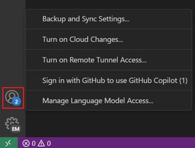
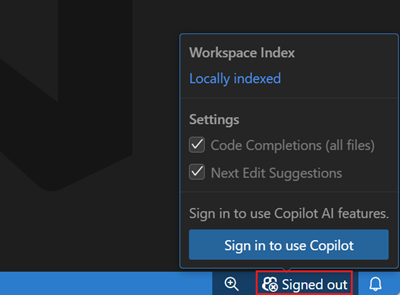
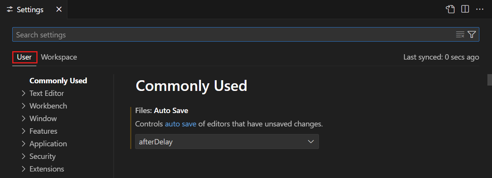

# Copilot guide: ask, understand, and verify

Copilot can explain unfamiliar code and suggest changes; it does not own your decisions. **AgentAlvine** is the separate GitHub automation that updates the lab's Exercise issue. Copilot cannot grant its progress, supply a genuine peer approval, or authorize Azure work.

Use this guide with the files already included in **this independent lab copy**. No earlier lab is required. If you have not created and opened your own private copy, begin with [start-here.md](start-here.md).

## Quick navigation

- [Sign in and select the Copilot account](#sign-in-and-select-the-copilot-account)
- [Open Chat and attach the right context](#open-chat-and-attach-the-right-context)
- [Choose Ask before Plan or Agent](#choose-ask-before-plan-or-agent)
- [Make the first question specific](#make-the-first-question-specific)
- [Challenge a suggestion without executing it](#challenge-a-suggestion-without-executing-it)
- [Review against schemas and tests](#review-against-schemas-and-tests)
- [Use Workspace settings deliberately](#use-workspace-settings-deliberately)
- [Recover without weakening controls](#recover-without-weakening-controls)

## Sign in and select the Copilot account

A browser login, Git's HTTPS credentials, VS Code's account list, and a Copilot seat are **four separate checks**. An organization can own the repository and assign the seat, but you sign in as your own personal GitHub account. Setting Git commit authorship does not sign in to any of them.

1. Open GitHub in the browser used for workshop authorization.
2. Check your personal username through the profile-picture menu.
3. Select **Accounts** at the lower left of VS Code.
4. Select **Sign in with GitHub to use GitHub Copilot** if that menu entry is present.
5. Use the Copilot status menu's **Sign in to use Copilot** button if that is the sign-in route your version shows.
6. Select **Allow** only for the expected GitHub extension sign-in request you initiated.
7. Check the personal username on the trusted browser authorization page.
8. Authorize the recognized VS Code request with that account.
9. Select **Open Visual Studio Code** if the browser asks to return to the editor.
10. Open **Accounts** → **Manage Extension Account Preferences...**.
11. Select the workshop account for the **GitHub Copilot** and **GitHub Copilot Chat** entries that are present.
12. Open Copilot's status menu to check whether access is available for that account.

If the preferences entry is not visible, open the **Command Palette** and search for **Manage Extension Account Preferences**. UI wording can vary slightly with the installed version. Do not sign every account out or change your unrelated extensions' account selections as a first troubleshooting step.



*REFERENCE — Microsoft publisher example, not an actual participant screen. CC BY 3.0 US; [sources and attribution](images/NOTICE.md).*



*REFERENCE — Microsoft publisher example, not an actual participant screen. CC BY 3.0 US; [sources and attribution](images/NOTICE.md).*

**Expected result:** Copilot uses the intended personal account and reports usable access. If an organization seat is expected, ask the instructor or license administrator to confirm that assignment; a generic free entitlement or a successful clone does not prove the assigned seat is active. Do not purchase a subscription or bypass an organization restriction to continue the lab.

> [!WARNING]
> Never paste passwords, tokens, private keys, recovery codes, device codes, or Terraform state into Chat, an issue, a terminal, or logs. Complete a device-code flow only on the trusted browser page opened by your intentional sign-in action. A prompt, suggested terminal command, or unfamiliar website asking for a secret is not the workshop sign-in procedure.

## Open Chat and attach the right context

1. Select the **Chat** button in VS Code's title bar.
2. Use **Ctrl+Shift+P** → **Chat: Open Chat** if the button is not visible.
3. Select **Ask** in Chat's mode selector before entering your first question.
4. Open the file named by the current **Exercise** task in the editor.
5. Type `#` in the chat input to open the context picker.
6. Select that file from the available file context entries.
7. Inspect the attached context chip to confirm the file belongs to this clone.
8. Add only the non-sensitive task text needed to explain your question.

The `#` picker adds **context**; simply mentioning a filename in a sentence is not a reliable substitute for attaching the intended file. You can also use **Add Context** when that control is available. Never attach an entire unrelated workspace, credentials, state, encrypted-plan material, private keys, or unredacted logs. Follow your organization's rules for sending repository content to Copilot, even when the repository is private.

On macOS, use **Cmd+Shift+P** for the Command Palette. On Linux, use **Ctrl+Shift+P** or the menu. The same **Chat**, **Ask**, and context-picker concepts apply on all three systems.

## Choose Ask before Plan or Agent

| Mode | Workshop use | Boundary to maintain |
| --- | --- | --- |
| **Ask** | Explain the attached file or diagnose a reported result | Start here; request reading and explanation only, with no edits or commands |
| **Plan** | Produce an ordered proposal and checks before implementation | Keep the plan read-only; do not accept an implementation handoff automatically |
| **Agent** | Perform a specifically authorized edit after you understand the plan | Inspect each proposed tool action, scope, and approval; decline unrelated actions |

A mode name is not a security guarantee. Available tools and approval settings can vary. For this workshop, keep **Ask** and **Plan** read-only, and do not approve file writes, command execution, installations, network actions, or cloud actions merely because they appear in a response.

If you later use **Agent**, approve only the narrow current-task action you understand. Do not enable blanket approvals, unattended execution, or unrestricted terminal access. A suggested command should be compared with [toolchain.md](toolchain.md#run-only-the-approved-offline-checks), not executed because it looks plausible.

## Make the first question specific

After attaching a non-sensitive task file, use a prompt such as this. Replace `CURRENT TASK TEXT` with the relevant task instructions, not account data or confidential evidence.

```text
I am new to this laboratory. Work read-only in Ask mode.
Explain the attached file in beginner language, then explain the current task:
CURRENT TASK TEXT
Identify which parts are already supplied and which parts I must complete.
Use Terraform 1.16.1 and AzureRM 5.4.0 when those are relevant.
Separate verified facts from assumptions and point to the supplied schema or tests.
Do not edit files, execute commands, install tools, access Azure, or request credentials.
```

1. Read the response before accepting any suggestion.
2. Identify one point you still do not understand.
3. Ask a follow-up question about that point with the relevant file context attached.
4. Record the useful explanation in the learner notes only when the task asks for notes.

Good follow-up questions name the actual uncertainty: an input type, the reason for a validation rule, why a test rejects an example, or the difference between a provider lock and a module pin. Avoid asking Copilot to finish the entire laboratory, tick issue progress, invent a passing result, or merge a PR for you.

## Challenge a suggestion without executing it

Use comparison as a learning exercise, not permission to try the unsafe option. For example:

```text
Compare keeping the supplied provider pin and narrow network rules with the
alternative of using the latest provider and broadly permissive rules.
Explain why the alternative could violate this task's contract and safety boundaries.
Do not implement either alternative, change permissions, run commands, or access Azure.
Suggest the smallest compliant change and the existing tests that should check it.
```

If Copilot suggests disabling validation, replacing mocks with a live provider, unlocking dependencies, granting broad workflow permissions, or bypassing review, reject that suggestion. Describe **why** it is unsuitable in the task's requested notes. Do not run the unsafe version to prove that you rejected it.

## Review against schemas and tests

1. Compare the proposed edit with the current task's acceptance criteria.
2. Check the real **AzureRM 5.4.0** provider schema or versioned provider reference when a resource property is involved.
3. Read the existing validation rules and provider-mocked tests, including rejection cases.
4. Make the smallest permitted edit only after understanding it.
5. Save the file with **Ctrl+S**, or **Cmd+S** on macOS.
6. Run the approved local checks from this lab's root when the task calls for them.
7. Inspect the complete diff in **Source Control** before staging.
8. Return to the current **Exercise** after the intended commit and push.

The [versioned AzureRM reference](https://registry.terraform.io/providers/hashicorp/azurerm/5.4.0/docs) is more relevant than an unversioned example generated from memory. A citation alone is not a passing test. Provider-mocked checks must actually run and test the required cases; zero tests, skipped tests, or a screenshot of an old green run are not success.

> [!NOTE]
> Preserve the supplied repository instructions. Do not run `/init` or accept automatic instruction generation that overwrites them. If the current task explicitly requests a small instruction change, make only that change and review its diff. Copilot's confidence, an AI review, or an AgentAlvine checkbox cannot replace the genuine nonauthor review required in Labs 1 and 5.

## Use Workspace settings deliberately

1. Press **Ctrl+,** to open **Settings**, or **Cmd+,** on macOS.
2. Select the **Workspace** tab for settings specific to this clone.
3. Search for the exact setting needed, such as **Editor: Tab Size**.
4. Inspect the current value and any language-specific override before changing anything.
5. Check **Editor: Insert Spaces** if you are diagnosing HCL indentation.
6. Preserve the supplied two-space HCL formatting and repository configuration.
7. Review any resulting tracked configuration diff in **Source Control**.



*REFERENCE — Microsoft publisher example, not an actual participant screen. CC BY 3.0 US; [sources and attribution](images/NOTICE.md). The **User** scope affects other projects too.*


*REFERENCE — Microsoft publisher example, not an actual participant screen. CC BY 3.0 US; [sources and attribution](images/NOTICE.md). Choose **Workspace** for a justified lab-specific setting.*

**User** settings apply across your projects; **Workspace** settings apply to the opened project and can be stored in tracked configuration. Neither scope is a reason to reset everything. If the workspace contains multiple unrelated repositories, reopen this clone alone before making a workspace change. Do not switch formatters or reformat the entire repository to conceal one HCL indentation problem.

## Recover without weakening controls

| Action | Expected result | Recovery |
| --- | --- | --- |
| Check **Accounts** and extension account preferences | Copilot selects the invited personal account | Correct only the affected extension's account selection |
| Ask the instructor about the assigned seat | The expected entitlement is confirmed | Wait for assignment or policy resolution; do not buy or bypass access |
| Attach one intended file with `#` | The context chip names the correct file | Remove unrelated context and reselect from this clone |
| Compare a response with schema and tests | A small, explainable, contract-preserving change | Reject unsupported properties and request a corrected explanation |
| Inspect an Agent action request | Only the understood current-task edit is proposed | Decline unknown commands, broad permissions, or cloud actions |

For a missing Chat button, blocked extension, authentication mismatch, or denied organization policy, use [troubleshooting.md](troubleshooting.md#sign-in-and-permissions-do-not-match). The doctor checks local setup only; it cannot verify that a human completed browser authorization or that a Copilot seat is usable.
