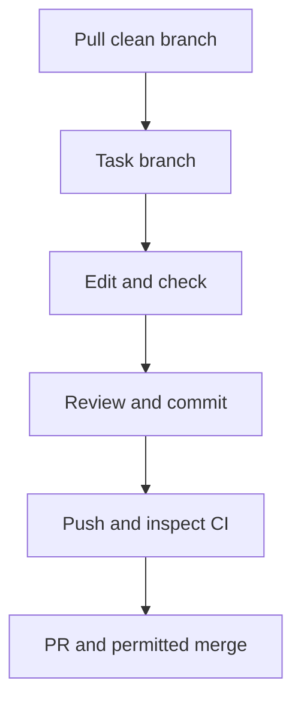

# Git workflow: from a saved file to a reviewed change

**Goal:** send an intentional task change to **your private copy**, inspect current checks, and merge only when the task and repository rules permit. Complete [start-here.md](start-here.md) first; the **Exercise issue** names the branch, files and required PR state.



Flow: synchronize clean work, use the task branch, edit/check, review/commit, push/check CI, then use a PR if required.

## Quick navigation

[Pull](#pull-before-starting-work) · [Branch](#create-the-task-branch) · [Edit](#open-edit-and-save-a-file) · [Commit](#review-stage-and-commit) · [Push](#publish-or-push-the-branch) · [PR](#open-a-pull-request-in-the-same-copy) · [Review and merge](#obtain-a-real-review-and-continue)

**Save** writes a file; **stage** selects its current changes; **commit** records them locally; **push** uploads commits. A **PR** proposes a merge. None grants Azure permission. Windows/Linux shortcuts use **Ctrl**; macOS uses **Cmd**.

## Pull before starting work

1. Read your current Exercise. In VS Code **Source Control**, check the clone and ensure no unsaved/uncommitted work before switching or pulling.
2. Select the branch in the status bar: actual default **`dev`** for new work, or the existing task branch when continuing. Choose **Source Control → ... → Pull** to receive its tracking branch's updates. A new unpublished branch has no upstream to pull yet.
3. **Expected:** the intended branch and clean working tree. If unclear, run these read-only commands separately; stop on errors, unexpected edits, conflicts or detached HEAD.

```powershell
git status --short --branch
git branch --show-current
```

| Command | What it does / flags | Expected |
| --- | --- | --- |
| `git status --short --branch` | `--short` summarizes changed files; `--branch` adds branch/tracking status | Intended branch, no unexpected changes |
| `git branch --show-current` | `--show-current` prints the selected branch | Exact task/default branch; empty can mean detached HEAD |

Check the copy's default label rather than copying `main` from a screenshot. Receive AgentAlvine's landing-page commits normally; never force-pull or discard/auto-stash work to proceed.

## Create the task branch

1. Open **Ctrl+Shift+P → Git: Create Branch...** and enter the Exercise's exact branch name, retaining its `lab/` prefix. If it already exists, select it instead.
2. Check the status bar. **Expected:** that task branch, based on the synchronized branch—not another folder or spelling.


*REFERENCE — Microsoft publisher example, not participant evidence. CC BY 3.0 US; [sources and attribution](images/NOTICE.md). Use your task's branch.*

## Open, edit, and save a file

1. Follow the Exercise's file link to the corresponding file in this clone's **Explorer**. Read it, make only the required edit, then **Ctrl+S**. **Expected:** the unsaved tab dot disappears.
2. Preserve supplied two-space HCL formatting and review [Copilot suggestions](copilot-guide.md) before accepting them. Do not reset global settings or reformat unrelated files.

**What it does:** when the task requests validation, this helper performs the [approved offline checks](toolchain.md#run-only-the-approved-offline-checks) from the clone root; it may download dependencies and prepare disposable test files. Expect executed cases, not zero/skipped tests; stop on failure. Lab 01 explains real GitHub event checks; Lab 07 uses the isolated offline root, not its live backend.

```powershell
node scripts/check-learner.mjs
```

## Review, stage, and commit

1. In **Source Control → Changes**, open each intended diff and read additions/removals. Choose its **+ / Stage Changes** only after review; check **Staged Changes** too.
2. Enter an accurate **Message**, then select **Commit** (not **Commit & Push** for this separate-step flow). **Expected:** a local commit containing only the reviewed task files.
3. If you edit after staging, review and stage that new version again. Cancel offers to stage everything automatically.


*REFERENCE — Microsoft publisher examples, not participant evidence. CC BY 3.0 US; [sources and attribution](images/NOTICE.md).*

Never stage credentials, caches, state, plans or unrelated work. Stop on sensitive content without reposting it. For a missing author, use [local authorship setup](start-here.md#set-authorship-only-for-this-repository), not a password.

## Publish or push the branch

1. First push: **Publish Branch → existing origin** for your private copy. Later: **Source Control → ... → Push**. Complete only the expected GCM browser sign-in with your own account.
2. Refresh that branch on GitHub and inspect its latest commit. **Expected:** your message/files and the local SHA below. **Publish to GitHub** may create another repository; do not use it here. Avoid combined **Sync Changes** and never force-push.

**What it does:** `git rev-parse HEAD` reads the full local commit identifier; `HEAD` means your current checkout. Expect a SHA to compare with the browser's full SHA/matching prefix; stop on an error or mismatch.

```powershell
git rev-parse HEAD
```

| Check | Expected |
| --- | --- |
| **Actions → Lab checks** | The latest pushed branch/SHA, not an earlier green run |
| PR checks | Associated with the latest PR head; GitHub's temporary merge SHA can differ |
| Existing **Exercise issue body** | Updated task feedback after AgentAlvine finishes |

## Open a pull request in the same copy

1. Only when requested, choose **Compare & pull request**, or **Pull requests → New pull request**. Keep **base repository** and **head repository** inside your private copy, never the public source.
2. Set **base** to the actual default, normally `dev`, and **compare** to your task branch. Review files, add a title and brief description of changes/checks/limitations, then **Create pull request**; use **Create draft pull request** when required.
3. **Expected:** the correct same-copy comparison and requested draft/ready state.

**Protected live exception:** Lab 07 delivery targets only instructor-prepared protected `main` with its [identity, backend, runner and independent encrypted-plan approvals](https://github.com/alvinea28/ws2-azure-delivery-laboratory-07/blob/dev/docs/delivery-configuration.md). Missing readiness means **stay offline**; do not create unprotected `main`, substitute `dev`, enable Azure or rerun a live job. This exception does not change dev-only template maintenance.


*REFERENCE — GitHub publisher example, not participant evidence. CC BY 4.0; [sources and attribution](images/NOTICE.md).*

## Obtain a real review and continue

1. Open **Files changed** and inspect your own diff and **current-head checks**. Labs **01/05 educational PRs do not require an external course reviewer**: you may merge your own PR using your own account **if repository rules permit**. This is self-inspection, **not self-approval**; GitHub does not allow approving your own PR.
2. If repository policy requires human approval, request an eligible nonauthor and wait. Address feedback on the same task branch and obtain any required fresh approval after edits. Do not impersonate reviewers, substitute AI approval, disable checks, change organization policy or use an administrator bypass.
3. When the task requires merging and every enforced check/approval is satisfied, choose the permitted merge method and confirm the target/revision. **Expected:** a real merged PR, not merely a closed one. Refresh the same Exercise.
4. With committed work and a clean tree, select the default branch and **Pull** before starting the next task.


*REFERENCE — GitHub publisher example, not participant evidence. CC BY 4.0; [sources and attribution](images/NOTICE.md).*

| Problem | Recovery |
| --- | --- |
| Push rejected/conflict | Preserve work; inspect [pull/push recovery](troubleshooting.md#pull-or-push-is-rejected) |
| Old/missing check or pending gate | Check the latest head and [PR feedback](troubleshooting.md#a-pr-or-progress-gate-remains-pending); never bypass it |
| Live Lab 07 approval unavailable | Leave live work pending; offline progress is not cloud authorization |
