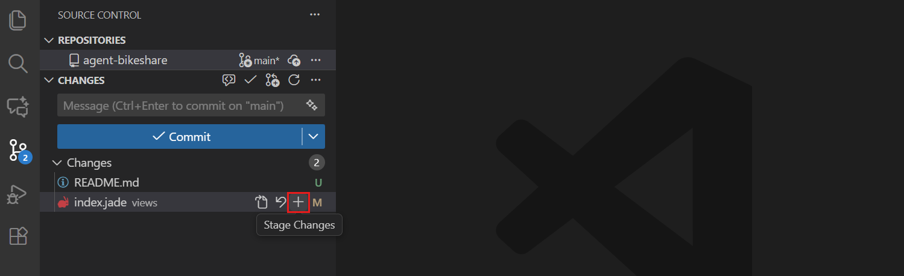
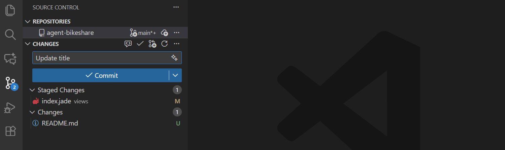
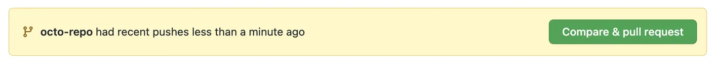
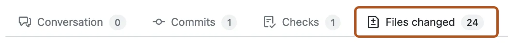

# Git workflow: from a saved file to a reviewed change

Use this guide **inside your own private copy of the current lab**. Complete [start-here.md](start-here.md) first. You need no other workshop repository. The current **Exercise** issue decides the branch name, files to change, checks to run, and whether a pull request is required.

## Quick navigation

[Pull before work](#pull-before-starting-work) · [Create the task branch](#create-the-task-branch) · [Open, edit, save](#open-edit-and-save-a-file) · [Review, stage, commit](#review-stage-and-commit) · [Publish or push](#publish-or-push-the-branch) · [Same-copy PR](#open-a-pull-request-in-the-same-copy) · [Real review](#obtain-a-real-review-and-continue)

**The distinction to remember:** saving changes a file on disk; staging selects changes for a commit; committing records them locally; pushing sends commits to GitHub. A PR proposes merging one branch into another. None of these operations is an Azure deployment approval.

Windows shortcuts below use **Ctrl**. On macOS, use **Cmd+Shift+P** for the Command Palette, **Cmd+O** for opening a file, and **Cmd+S** for saving. Linux uses the Windows shortcuts. The named menus work on all three systems.

## Pull before starting work

1. Open the **Exercise** issue in your private copy.
2. Read its current task before choosing a branch.
3. Open **Source Control** in VS Code's left Activity Bar.
4. Inspect the repository name to ensure this is the correct clone.
5. Confirm the working tree is clean, with no unsaved or uncommitted edits, before switching branches or pulling.
6. Select the current branch name in the lower-left status bar.
7. Select the actual default branch for a new task, or your existing task branch when continuing work.
8. Open **Source Control** → **...** → **Pull** on that branch.

For a new branch, use the copy's **actual default branch**, normally `dev`; look for **default** beside its name in GitHub's **Code** branch selector rather than copying `main` from a screenshot. For an existing task branch, pull its own tracking branch. A newly created, unpublished branch has no remote counterpart yet and does not need a pull from an invented upstream.

Run these read-only checks one line at a time if the editor state is unclear; the commands work in PowerShell, macOS, and Linux shells:

```powershell
git status --short --branch
git branch --show-current
```

**Expected result:** the intended branch is selected, with no unexpected changed files. If there are changes, conflicts, or a detached-head indication, stop and use [troubleshooting.md](troubleshooting.md#pull-or-push-is-rejected). Do not switch blindly, discard work, auto-stash it, or force a pull. An AgentAlvine README update is an ordinary commit to receive, not a reason to rewrite remote history.

## Create the task branch

1. Press **Ctrl+Shift+P**.
2. Select **Git: Create Branch...**.
3. Enter the exact branch name specified by the current task.
4. Press **Enter**.
5. Read the branch indicator at the lower left to confirm the new name.

The branch is created from the branch you synchronized above. If the task says `lab/network-request`, use that name for that task; it is not the required name for every lab. Retain the required `lab/` prefix. If the task branch already exists, select that existing branch instead of creating another spelling of it.


*REFERENCE — Microsoft publisher example, not an actual participant screen. CC BY 3.0 US; [sources and attribution](images/NOTICE.md). Your branch should match the current task, not the example.*

## Open, edit, and save a file

1. Find the required file link in the current **Exercise** issue.
2. Locate the corresponding file under this clone's **Explorer** root.
3. Select that file, or use **File** → **Open File...** and choose it inside this clone.
4. Read the existing content before changing it.
5. Edit only what the current task asks you to complete.
6. Press **Ctrl+S** to save the file.
7. Check that the unsaved-change dot on the editor tab has disappeared.

On macOS, the menu may say **File** → **Open...**. The file dialog can reach other folders, so check the path before opening a similarly named file from another clone. Copilot suggestions are not automatically accepted changes: use [copilot-guide.md](copilot-guide.md) to ask questions and review any proposed edit.

Keep the supplied two-space HCL indentation. Do not reset global editor settings or reformat unrelated files. When the current task asks for validation, run the approved helper from this repository's root:

```powershell
node scripts/check-learner.mjs
```

Read [toolchain.md](toolchain.md#run-only-the-approved-offline-checks) before running it for the first time. In Lab 1 it explains that collaboration is checked through real GitHub events; it does not award a review. In Lab 7 it uses the isolated offline path, not the canonical remote-backend environment.

## Review, stage, and commit

1. Open **Source Control**.
2. Select a file under **Changes** to inspect its diff.
3. Read every removal and addition, including any deleted lines or changed permissions.
4. Select that file's **+** button, whose tooltip is **Stage Changes**, only if its diff is intended.
5. Select the file under **Staged Changes** to review what the commit will contain.
6. Repeat the review and staging process for each intended task file.
7. Enter a short, accurate description in **Message**, such as `lab: describe the network request` when that describes your change.
8. Select **Commit** to create the local commit.



*REFERENCE — Microsoft publisher example, not an actual participant screen. CC BY 3.0 US; [sources and attribution](images/NOTICE.md).*



*REFERENCE — Microsoft publisher example, not an actual participant screen. CC BY 3.0 US; [sources and attribution](images/NOTICE.md).*

If VS Code offers to stage **all** files automatically, cancel and stage the reviewed files individually. If the main button says **Commit & Push**, use its dropdown to choose **Commit** for this separate-step workflow. A file edited after staging needs another diff review and staging step; otherwise the commit contains the earlier staged version.

> [!WARNING]
> Do not stage credentials, local caches, Terraform state, plan files, or unrelated changes. If sensitive material appears, stop and contact the instructor without copying it into chat or logs. Setting Git authorship is local setup, not sign-in; repair a missing author through [the local authorship steps](start-here.md#set-authorship-only-for-this-repository), never by supplying a password to Git configuration.

## Publish or push the branch

1. Select **Publish Branch** for the first push of a new local task branch.
2. Select the existing `origin` remote for your private copy if VS Code asks where to publish.
3. Complete any expected Git Credential Manager browser authorization with the correct personal account.
4. Use **Source Control** → **...** → **Push** for subsequent commits on that published branch.
5. Wait for the operation to finish before checking GitHub.
6. Refresh your private copy's **Code** page in the browser.
7. Select your task branch in the branch dropdown.
8. Open its latest commit to verify the message and changed files.

**Publish Branch** sends a branch to the existing copy. **Publish to GitHub** can mean creating another repository; do not use that as a substitute for cloning your own copy. Avoid **Sync Changes** until you understand that it can combine pull and push. Never choose **Force Push** to get past an error.


*REFERENCE — Microsoft publisher example, not an actual participant screen. CC BY 3.0 US; [sources and attribution](images/NOTICE.md).*

Read the exact local commit identifier with this read-only command:

```powershell
git rev-parse HEAD
```

| Action | Expected result | Recovery |
| --- | --- | --- |
| Compare the browser branch commit with local `HEAD` | The same full SHA, or its matching displayed prefix | Save, commit, and push any missing work; do not treat another branch's commit as yours |
| Open **Actions** → **Lab checks** for the latest branch push | The run belongs to this branch and this SHA | A green run for an earlier SHA is not current validation |
| Inspect a PR's checks | Checks are associated with the latest PR head | GitHub can test a temporary merge commit; inspect the PR's latest-head association rather than confusing its merge SHA with your branch SHA |
| Refresh the **Exercise** issue body | Current feedback reflects eligible events | Allow the guide to finish; use [troubleshooting.md](troubleshooting.md#agentalvine-or-the-exercise-is-missing) if it remains stale |

## Open a pull request in the same copy

Open a PR **only when the current task asks for one**. Keep the source and target repositories inside your private copy; do not send a participant PR to the public template.

> [!WARNING]
> **Lab 7 exception:** a delivery PR may target only the instructor-prepared, protected `main` in the approved private copy after identity, backend, runner, and independent encrypted-plan review readiness are established. If that branch or readiness is missing, retain your offline task branch and hand it to the instructor. Do not create an unprotected `main`, substitute `dev` for live delivery, enable Azure, or rerun a live job.

1. Select **Compare & pull request** on your copy's page after a push.
2. Use **Pull requests** → **New pull request** if the banner is absent.
3. Confirm that **base repository** and **head repository**, if displayed, both identify your copy.
4. Select the copy's actual default branch, normally `dev`, in **base**, except for the instructor-authorized Lab 7 `main` route described above.
5. Select your task branch in **compare**.
6. Review the changed-file list before creating the PR.
7. Enter a title describing the task's result.
8. Enter a description of the change, checks performed, and remaining limitations.
9. Select **Create pull request**, or its dropdown's **Create draft pull request** when the task requires a draft.



*REFERENCE — GitHub publisher example, not an actual participant screen. CC BY 4.0; [sources and attribution](images/NOTICE.md).*

## Obtain a real review and continue

1. Open the PR's **Files changed** tab to check the submitted diff again.
2. Select an eligible classmate or instructor through **Reviewers** when review is required.
3. Wait for that person to review the latest pushed commit.
4. Address feedback on the same task branch through the save → stage → commit → push cycle.
5. Request a fresh review after changing the reviewed head.
6. Confirm that the current task requires a merge and all required checks and approvals are satisfied.
7. Select **Merge pull request** using the repository's permitted merge method.
8. Select **Confirm merge** only after checking the displayed target and reviewed revision; if only another merge method is offered, follow the instructor's specified method instead.
9. Refresh the **Exercise** issue to read the next task.



*REFERENCE — GitHub publisher example, not an actual participant screen. CC BY 4.0; [sources and attribution](images/NOTICE.md).*

For **Labs 1 and 5**, an actual eligible **nonauthor** must use **Files changed** → **Review changes** → **Approve** → **Submit review** after inspecting the last head. The reviewer must not be the PR author or author of the code being approved. A requested review, a comment, a Copilot review, or a self-approval is not the required human approval. If no eligible person has access, ask the instructor; leave the gate pending rather than impersonating a reviewer.

After a merge, first ensure your current work is safely committed and the working tree is clean. Then select the default branch and **Pull** before creating the next task branch. AgentAlvine may add README progress commits there; receive them normally. Do not force-push, blindly discard or stash changes, manually tick the exercise, or bypass branch protection to make progress appear complete.
