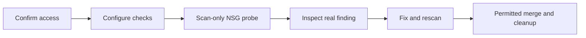

# Repository security: find, fix and rescan

[First-time setup](start-here.md) · [Git help](git-workflow.md) · [Repository](../README.md)

**Goal:** practise repository checks from [Microsoft's DevSecOps IaC flow](https://learn.microsoft.com/en-us/azure/architecture/solution-ideas/articles/devsecops-infrastructure-as-code), before Terraform AVM deployment. No Sentinel or Azure deployment here.

> [!IMPORTANT]
> Additional procedure, **outside the original 33 graded activities**. Authoring
> ran no settings changes/scans/integrations. Live Azure remains **blocked pending
> separate prerequisites/approvals**. AgentAlvine progress/screenshots grant
> neither completion nor Azure access.

## 1. Confirm access before enabling anything

Follow [setup](start-here.md) to install, sign in, copy, clone and open your private
repository. Its supplied baseline needs no earlier lab. Confirm repository-admin
or authorized security-manager permissions, Actions budget and organization rules.
For private organization-owned repositories, code scanning/dependency review need
**GitHub Team/Enterprise** and **Code Security**; secret scanning/push protection
need **Secret Protection**. Confirm add-ons/cost approval; Copilot does not supply them.
Unavailable features are **blocked, not passed**; never change visibility to evade licensing.

## 2. Configure checks in your copy

Open **Settings → Code Security / Secret Protection** under Security (sometimes
**Advanced Security**). Record current settings; enable only approved features.

1. Enable **Dependency graph** and **Dependabot alerts/security updates**. The graph
    inventories supported dependencies; alerts flag known vulnerable versions;
    updates propose repairs. Inspect **Insights → Dependency graph**, then
    **Security → Dependabot alerts**: actual advisory/version/repair PR if present.
    Empty results are not detection.
2. On a supported dependency-update PR, open **Files changed → Dependency review**;
    configure the approved **Dependency review** Security workflow template if
    available. It checks introduced vulnerabilities/configured license restrictions.
    Missing licensing, snapshots or supported changes means blocked, not passed.
3. For unconfigured CodeQL, use **CodeQL analysis → Set up → Advanced** for detected
    JavaScript. CodeQL finds supported-language vulnerabilities, **not Terraform/HCL**.
    Preserve existing analysis.
4. For Terraform, **Actions → New workflow → Security → View all → Configure** an
    approved Checkov/Terraform scanner. Its **Documentation** panel explains scan
    paths and SARIF output/upload. IaC scanning detects resource misconfigurations;
    SARIF transports findings to **Security → Code scanning**. No workflow is
    supplied by this guide.

Verify organization-approved action revisions; never guess SHAs/versions or use
floating examples. PR scans keep read-only tokens: **no Azure/OIDC/secrets/state**.
SARIF upload needs a trusted publisher with `security-events: write`, no PR-code
execution and results bound to the scanned commit. Without an approved route,
GitHub-alert evidence is blocked. Use a same-copy setup PR via
[Git help](git-workflow.md).

[Microsoft's MSDO scan procedure](https://learn.microsoft.com/en-us/azure/defender-for-cloud/iac-vulnerabilities)
has separate connected-Defender prerequisites. Do not copy its federation/write
permissions into PR checks. GitHub results do not prove Defender ingestion/runtime posture.

## 3. Observe a nonsecret red finding

In VS Code, create branch `lab/security-companion`. Make a Terraform file in a
new **scan-only subfolder outside deployment roots**. Copy only the
`azurerm_network_security_rule` block from the
[reference](../solutions/reference/modules/subnet-security/main.tf).
Remove `for_each` from the copy and replace references with these literal values:

| Copied attributes | Values and meaning |
| --- | --- |
| `name`, `resource_group_name`, `network_security_group_name` | All `"ws2-scan-only"`: fictional names. |
| `priority`, `direction`, `access`, `protocol` | `100`, `"Inbound"`, `"Allow"`, `"Tcp"`: inbound TCP. |
| `source_port_range`, `destination_port_range` | `"*"`, `"22"`: any source port to SSH. |
| `source_address_prefix`, `destination_address_prefix` | `"0.0.0.0/0"`, `"*"`: every IPv4 origin, any destination. |
| `description` | `"Scan-only; never deploy"`. |

This negative fixture is **not an AVM replacement**. Preserve validators/reference
files; include the folder in scan paths. **Never initialize, plan or apply it**.
Save → inspect → stage → commit → push; open a same-copy draft PR.

Open **Actions → security workflow → matching commit → scanner job**. Inspect
rule ID, file, message and SARIF/alert. **Expected:** unrestricted SSH finding.
Missing finding? Check Terraform support, paths and parser errors. Unrelated
errors/zero resources are not detection; never disable guards.

## 4. Fix, rescan and clean up

Replace only the source with your **assigned narrow admin CIDR**; push to the same
PR. Verify the new scan clears that exact finding, not merely a green job.
Then remove only your test fixture through the **same PR** and rerun checks.
Keep protection enabled. Self-inspect current diffs/checks; actually merge only
where rules permit. GitHub cannot approve your own PR; wait for required
nonauthor reviews, never bypass restrictions.

## 5. Inspect secret protection safely

Secret scanning detects recognized credentials; push protection blocks supported
secret-containing pushes. Enable both where approved; inspect **Security → Secret
scanning** and [supported patterns](https://docs.github.com/en/code-security/secret-scanning/introduction/supported-secret-scanning-patterns).
Use only an owner-approved, documented **nonfunctional official test pattern**.
None is supplied: **blocking test not executed**. Random dummy strings prove
nothing. Never commit real secrets or bypass blocks. Accidental exposure requires
immediate provider revocation/rotation and owner notification, not just deletion.
Never share secrets.

**Actual evidence:** no authoring scan results. Keep actual run URLs, commits,
finding/fix details and blockers privately; redact before sharing. **Expected is
not observed**. No manual checkboxes, evidence-PR protocol or screenshot-based credit.

**Official references:** [Feature availability](https://docs.github.com/en/get-started/learning-about-github/about-github-advanced-security) · [Advanced setup](https://docs.github.com/en/code-security/code-scanning/creating-an-advanced-setup-for-code-scanning/configuring-advanced-setup-for-code-scanning) · [Dependency review](https://docs.github.com/en/code-security/supply-chain-security/understanding-your-software-supply-chain/about-dependency-review).
