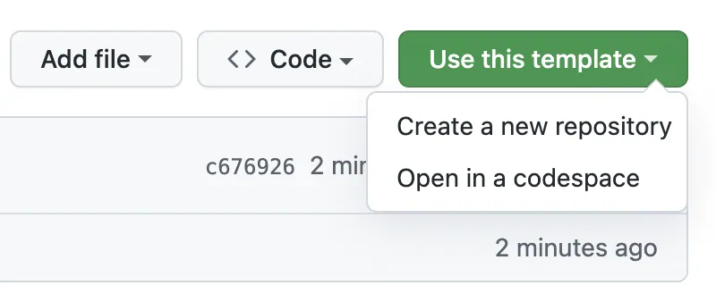
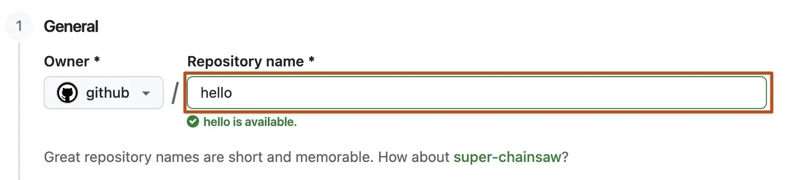
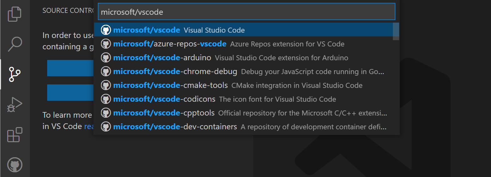

# Start here: your first independent workshop lab

This guide takes you from a GitHub account to the **current task in your own private laboratory copy**. You do not need to complete, clone, or keep another workshop repository. Each numbered lab contains its own starting materials and checks.

Choose a laboratory in the [workshop catalogue](https://github.com/alvinea28/ws2-workshop-catalogue). Its number suggests a learning order, not a dependency. Keep this guide open in one browser tab and your own repository in another.

> [!WARNING]
> Setup is not permission to use Azure. Do not sign in to Azure, initialize a real remote backend, run a real infrastructure plan or apply, or access state. Never paste passwords, tokens, private keys, recovery codes, or Terraform state into chat, a terminal, an issue, or logs. Complete credential and device-code flows only through trusted browser and VS Code sign-in UI that you initiated.

## Quick navigation

- [Understand the different accounts and places](#understand-the-different-accounts-and-places)
- [Prepare your GitHub account](#prepare-your-github-account)
- [Create your own private copy](#create-your-own-private-copy)
- [Wait for AgentAlvine](#wait-for-agentalvine)
- [Clone your copy into desktop VS Code](#clone-your-copy-into-desktop-vs-code)
- [Open and trust only this clone](#open-and-trust-only-this-clone)
- [Check the terminal location and remote](#check-the-terminal-location-and-remote)
- [Set authorship only for this repository](#set-authorship-only-for-this-repository)
- [Connect the correct Copilot account](#connect-the-correct-copilot-account)
- [Check installed tools](#check-installed-tools)
- [Run the read-only doctor](#run-the-read-only-doctor)
- [Open the current Exercise](#open-the-current-exercise)

## Understand the different accounts and places

| Place or identity | What it controls | What it does not prove |
| --- | --- | --- |
| GitHub in your browser | Creating your copy, reading issues, reviewing PRs | Which account Git uses to push from your computer |
| Git credentials, usually managed by Git Credential Manager | Authentication for HTTPS clone, pull, and push | Which account Copilot uses |
| VS Code **Accounts** | Accounts available to editor extensions | That every extension selected the same account |
| Copilot seat or entitlement | Permission for your personal account to use Copilot | Write access to a repository or permission to deploy |
| Git `user.name` and `user.email` | Authorship recorded in new commits | Sign-in, a Copilot seat, or repository permissions |
| Repository **Owner** | The personal account or organization containing the copy | The identity of the person currently signed in |

An organization is a container for repositories, not a personal login. If the instructor assigns an organization as **Owner**, you still sign in with your own invited GitHub account. Membership, a Copilot seat, and repository write permission are separate grants.

**Copy** creates a new GitHub repository from the template. **Clone** downloads that repository and its Git history into a folder on your computer. A **branch** is a line of work inside the repository, not another folder. A **commit** records work locally; a **push** sends commits to GitHub. See [glossary.md](glossary.md) for these terms in context.

Windows is the primary route below. On macOS, use **Cmd+Shift+P** instead of **Ctrl+Shift+P**, **Cmd+S** instead of **Ctrl+S**, and **Cmd+,** instead of **Ctrl+,**. Linux uses the Windows shortcuts unless your desktop intercepts them; the named menu commands remain available.

## Prepare your GitHub account

1. Open [GitHub](https://github.com/) in your regular browser.
2. Select **Sign up** if you do not yet have a personal account.
3. Complete GitHub's email-verification process in the trusted browser.
4. Select **Sign in** if you already have an account.
5. Open your profile-picture menu to check the exact personal username.
6. Accept the instructor's organization or repository invitation while using that account.
7. Complete any organization-required single sign-on or two-factor authentication in the trusted browser.
8. Ask the instructor to confirm that the workshop Copilot seat is assigned to this same personal account.

**Expected result:** you know which personal account to use and which **Owner** the instructor permits for your private copy. Accepting an invitation alone does not prove that a Copilot seat has been assigned. Do not purchase a plan or change organization policies to get past a workshop setup problem.

> [!NOTE]
> Desktop VS Code and Git must be available before the clone step. If either is missing, follow the relevant Windows, macOS, or Linux section of [toolchain.md](toolchain.md), then return here. The full version check happens after the account and folder checks below.

## Create your own private copy

> [!IMPORTANT]
> **Already in your own private copy or its Exercise issue?** This part is complete. Do not create another copy. Continue with [Wait for AgentAlvine](#wait-for-agentalvine) if needed, then [clone your existing copy](#clone-your-copy-into-desktop-vs-code).

1. Open the selected numbered public template from the [workshop catalogue](https://github.com/alvinea28/ws2-workshop-catalogue).
2. Confirm that its topic and final two-digit number match the lab you intend to take.
3. Select **COPY EXERCISE** on the template's landing page.
4. Use **Use this template** → **Create a new repository** if the copy button is unavailable.
5. Select your personal account, or the specifically assigned organization, in **Owner**.
6. Enter a unique **Repository name** that preserves the original final number.
7. Select **Private** under repository visibility.
8. Leave **Include all branches** unchecked unless the instructor explicitly requires otherwise.
9. Select **Create repository**.
10. Confirm that the new page shows your chosen owner, your new name, and the **Private** badge.

For example, a Lab 4 copy could be named `my-ws2-terraform-tests-docs-laboratory-04`: adding `my-` preserves the final `04`. Do not replace that ending with a date or your name. Use the ending for **your selected lab**, not `04` for every copy. This operation is a template copy, not **Fork**, **Download ZIP**, or a clone of the public source.



*REFERENCE — GitHub publisher example, not an actual participant screen. CC BY 4.0; [sources and attribution](images/NOTICE.md).*


*REFERENCE — GitHub publisher example, not an actual participant screen. CC BY 4.0; [sources and attribution](images/NOTICE.md).*



*REFERENCE — GitHub publisher example, not an actual participant screen. CC BY 4.0; [sources and attribution](images/NOTICE.md).*

| Action | Expected result | Recovery |
| --- | --- | --- |
| Inspect your copy's header | Your chosen owner and a **Private** badge | If you are still on the public template, return to the copy procedure |
| Open your copy's **Code** tab | Its own files and branch dropdown | A new copy can take a little time to finish appearing; refresh |
| Check the selected branch | The actual default branch, normally `dev` | Do not create or rename `main` merely because a screenshot shows it |

## Wait for AgentAlvine

1. Wait **20–60 seconds** after GitHub finishes creating the copy.
2. Refresh your copy's repository landing page.
3. Select the **Exercise** link added to its README by **AgentAlvine**.
4. Open **Issues** if the landing-page link has not appeared yet.
5. Open the active exercise issue created by the workshop automation.

**Expected result:** the issue body contains progress, current instructions, and a next action for this copy. Keep that tab open while completing setup. The automation may appear as `github-actions[bot]`; **AgentAlvine** is its workshop name, not Copilot Chat.

If nothing appears, follow [the missing-exercise checks](troubleshooting.md#agentalvine-or-the-exercise-is-missing). A busy Actions queue can take longer than the initial wait. Do not fabricate an exercise issue, type a manual check command, edit progress checkboxes, or run a delivery workflow to force startup.

## Clone your copy into desktop VS Code

1. Open your **private copy's** **Code** tab in the browser.
2. Select the green **Code** button.
3. Select **HTTPS** in the clone panel.
4. Copy the repository's credential-free HTTPS URL using the copy button.
5. Open the installed **Visual Studio Code** desktop application.
6. Press **Ctrl+Shift+P** to open the **Command Palette**.
7. Select **Git: Clone**.
8. Choose **Clone from GitHub** to find your private copy, or paste the HTTPS URL copied in step 4.
9. Check the owner and full numbered repository name before selecting the result.

The URL must identify **your copy**, not the public template or the catalogue. It must not contain a username/password credential pair, token, issue path, or `/tree/` branch path. If the picker does not list the copy, check your sign-in and invitation rather than choosing a similarly named source repository.



*REFERENCE — Microsoft publisher example, not an actual participant screen. CC BY 3.0 US; [sources and attribution](images/NOTICE.md). Choose your private copy, not a Microsoft example.*

If authorization appears during the picker or clone, complete this sequence before continuing:

1. Select **Allow** only for the expected GitHub sign-in request you just initiated in VS Code.
2. Check the personal username on the trusted GitHub browser authorization page.
3. Switch to the invited workshop account in the browser if the wrong account is shown.
4. Approve the recognized VS Code or Git Credential Manager authorization request.
5. Select **Open Visual Studio Code** if the browser asks to return to the application.

Git Credential Manager may present a separate browser sign-in for Git's HTTPS connection. That is distinct from the editor's **Accounts** menu. If a terminal unexpectedly asks you to paste a credential, cancel that prompt and consult [account recovery](troubleshooting.md#sign-in-and-permissions-do-not-match); do not create or paste a token.


*REFERENCE — Microsoft publisher example, not an actual participant screen. CC BY 3.0 US; [sources and attribution](images/NOTICE.md).*

## Open and trust only this clone

1. Choose a normal local **parent folder** in the clone destination dialog, such as a dedicated workshop folder in your Documents area.
2. Select **Select as Repository Destination** to let Git create the repository's own child folder.
3. Select **Open** when VS Code reports that cloning has finished.
4. Read the **Workspace Trust** prompt for the folder you just opened.
5. Trust the folder only if it is your known workshop copy from the expected template.
6. Inspect the top-level folder shown in **Explorer**.

**Expected result:** the Explorer root is **this clone**, with this lab's files directly underneath it. It is not the parent containing several labs, an authoring multi-repository workspace, an extracted ZIP, or a `github.dev` virtual workspace. Do not choose an option that trusts the entire parent folder or every repository on the computer.

If you opened the wrong location, use **File** → **Open Folder...** to select the cloned repository folder itself. On macOS, **File** → **Open...** may be the corresponding folder picker. If the current window contains unrelated work, open the clone in a separate window. A ZIP or browser-only editor does not provide this guide's local Git-and-terminal workflow.

## Check the terminal location and remote

1. Select **Terminal** → **New Terminal** in the VS Code window containing this clone.
2. Confirm that the selected Windows terminal profile is **PowerShell**.
3. Run each line below separately, pressing **Enter** after each command.

```powershell
Get-Location
git rev-parse --show-toplevel
git remote -v
```

On macOS or Linux, use your normal shell and these equivalent read-only checks:

```bash
pwd
git rev-parse --show-toplevel
git remote -v
```

| Action | Expected result | Recovery |
| --- | --- | --- |
| Read the current location | The root folder of this lab clone | Reopen the correct folder and create a new terminal |
| Read Git's top-level directory | The same repository root; slash style may differ | Stop if Git reports another root or **not a git repository** |
| Inspect both `origin` entries | Fetch and push target your private copy's owner/name | Do not push if either points at the public source; use [folder and remote recovery](troubleshooting.md#the-wrong-folder-or-remote-is-open) |

A successful clone of a **public** template proves only that its public contents can be read. Even reading a private copy does not prove push permission. Only a successful authorized push of the intended task branch demonstrates that write access works. Do not publish an unrelated test commit merely to check access.

## Set authorship only for this repository

Git needs an author name and email before it creates commits. These values are **not a GitHub sign-in**. Use a name you want attached to your work and a GitHub-verified email, or the exact privacy-preserving **noreply** address shown in your personal GitHub **Settings** → **Emails**. Do not invent a noreply address from a screenshot.

1. Confirm that the terminal is still at this clone's root.
2. Replace `YOUR-DISPLAY-NAME` below with your intended commit author name.
3. Replace `YOUR-VERIFIED-OR-NOREPLY-EMAIL` with your chosen non-secret author email.
4. Run the two edited commands, keeping the quotation marks.

```powershell
git config --local user.name "YOUR-DISPLAY-NAME"
git config --local user.email "YOUR-VERIFIED-OR-NOREPLY-EMAIL"
```

The same two commands work in macOS and Linux shells. They affect **only this repository**, not every project or account on your computer. Run these read-only checks afterward:

```powershell
git config --local --get user.name
git config --local --get user.email
```

**Expected result:** the chosen name and email appear, with no placeholder text. They become metadata in new commits; setting them does not change the authorship of existing commits. Never substitute an account password, access token, or private key for either value.

## Connect the correct Copilot account

1. Select **Accounts** in VS Code, usually at the lower left.
2. Select **Sign in with GitHub to use GitHub Copilot** if offered.
3. Complete the trusted browser authorization with your workshop personal account.
4. Open **Accounts** → **Manage Extension Account Preferences...** to check the account selected for the Copilot extension entries.
5. Check Copilot's status for access through that account's assigned seat or approved entitlement.

See [copilot-guide.md](copilot-guide.md#sign-in-and-select-the-copilot-account) for screenshots, alternate sign-in labels, and the first read-only chat. If the organization owns the repository, still select your **personal** account, not the organization name. A working browser login or Git clone is not evidence that Copilot is licensed for that account.

## Check installed tools

Follow [toolchain.md](toolchain.md) for official downloads, architecture choices, safe PATH setup, and individual version checks. Every lab uses **Git, desktop VS Code and Node.js 24.16.0**. **Lab 01 does not need Terraform.** Labs **02–08** use **Terraform 1.16.1** and the supplied **AzureRM 5.4.0** provider lock. **terraform-docs 0.24.0 is needed only for Lab 04**.

After a tool or PATH change, save your work and fully close and reopen VS Code before creating a new terminal. Merely opening another terminal in an old VS Code process may retain the old PATH. Do not change system-wide environment settings, reset all editor settings, or install an Azure login tool to satisfy these offline prerequisites.

## Run the read-only doctor

1. Confirm once more that **Explorer** and the terminal identify this lab's root.
2. Run the setup doctor from that root.

```powershell
node scripts/doctor.mjs
```

3. Read every reported problem before proceeding to an exercise command.

The doctor is a **read-only root, tools, and Git-identity check**. It does not install tools, repair configuration, authenticate to GitHub, verify a browser session, grant a Copilot seat, or authorize Azure. It is not a replacement for the human account checks above. If the script is missing, report an incomplete lab package; do not invent a successful result or generate a replacement with Copilot.

## Open the current Exercise

1. Return to **your copy's** active **Exercise** issue in the browser.
2. Refresh the page to read the current **issue body**, not just the newest comment.
3. Read the current task's required branch, file links, acceptance criteria, and next action.
4. Follow [git-workflow.md](git-workflow.md) for the branch → edit → save → review → commit → push cycle.
5. Return to the same issue after each relevant push, check, PR, review, or release.

AgentAlvine updates that issue automatically. A task may intentionally begin with incomplete files or failing learner checks. Finish the specified task rather than copying all solutions, creating evidence PRs, entering run IDs, or marking progress by hand. When the task calls for local validation, use the approved `node scripts/check-learner.mjs` command described in [toolchain.md](toolchain.md#run-only-the-approved-offline-checks).

> [!WARNING]
> Labs **1 and 5 require real peer review**; neither Copilot nor a self-approval can replace it. Lab **7 remains offline** unless an instructor has prepared an approved private copy with protected `main`, identities, backend, restricted runner, and independent encrypted-plan review. No live-job reruns are a setup shortcut. A green exercise checkbox is never Azure deployment authorization.

**Ready means:** your own private copy, the correct local clone, verified local authorship, the intended Copilot account, matching tools, a reviewed doctor result, and the actual current Exercise. If any one is uncertain, use [troubleshooting.md](troubleshooting.md) before changing code.
