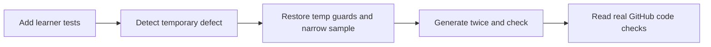
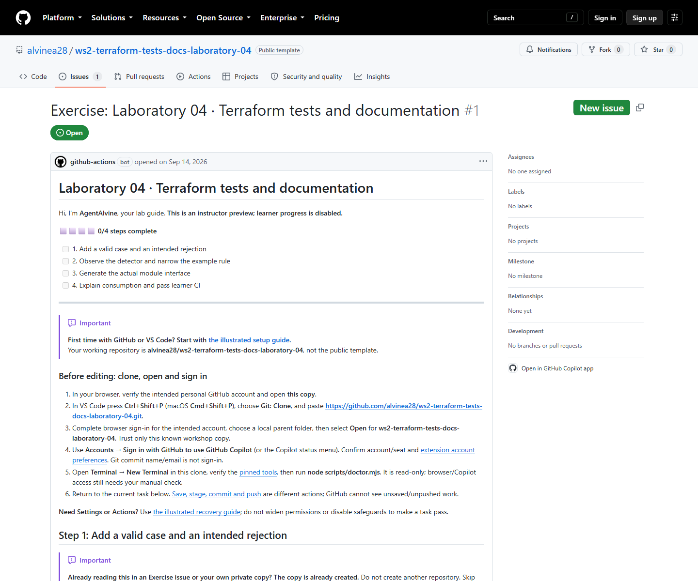

# Laboratory 04 — Full workshop review

> Review copy; follow your private copy’s live Exercise issue to do the lab.

[Full first-time setup](00-start-here.md) · [Enter your Azure values and sign in](azure-setup.md) · [Original simulation summary and verification limits](simulation.md) · [Repository landing page](../README.md)

All four lessons mirror the Exercise text; only relative Markdown links **outside code fences** are rebased. Snippets keep links for their destination files. No earlier lab is required.

## Test-to-docs sequence

Plain text: add tests → harness detects and restores its temporary defect → narrow the actual sample → generate docs twice and check freshness → inspect real code checks. **Never seed-mutate source validators.**

Use Node **24.16.0**, Terraform **1.16.1**, AzureRM **5.4.0**, terraform-docs **0.24.0**.

| Activity | Full lesson | Cycle A | Cycle B |
| --- | --- | --- | --- |
| 01 | [Add a valid case and an intended rejection](activity-01.md) | Recorded verified | Recorded verified |
| 02 | [Observe the detector and narrow the example rule](activity-02.md) | Recorded verified | Recorded verified |
| 03 | [Generate the actual module interface](activity-03.md) | Recorded verified | Recorded verified |
| 04 | [Explain consumption and pass learner CI](activity-04.md) | Recorded verified | Recorded verified |

These **2026-09-08 Revision 4 private simulations** each recorded **4/4 offline completion**, including docs. An older generator issue is not an unresolved A/B blocker. Whole-lab counts are not per-activity or unique totals inflated by fixture/seed repeats.

## Use your own Exercise

1. Copy once from the [landing page](../README.md), clone/open it and use **your copy's Exercise link**, not the source Preview.
2. On `lab/tests-docs`, **Save → stage → commit → push → refresh the SAME Exercise**. [Git help](../docs/git-workflow.md) explains each action.
3. Inspect **Actions → Lab checks → newest commit → Test learner module**. AgentAlvine updates the same issue body from real work; no manual checkboxes, evidence PR or human approval gate.

The full checker covers root, child, actual fixture, isolated detector and canonical docs without Azure credentials/OIDC/state. The additional [repository security hands-on guide](security-hands-on.md) is copied in full with rebased links: licensed GitHub protection and a scan-only Terraform finding/fix. It is outside these four gates and the original 33-step grader; no new integration evidence or screenshot-based credit is claimed. Neither code checks nor issue progress authorize cloud deployment.

## Public source preview — read only, not your learner issue

[Source Exercise #1](https://github.com/alvinea28/ws2-terraform-tests-docs-laboratory-04/issues/1) was observed on **2026-09-14** as a read-only instructor Preview, step 0 (**0/4**). It is neither private Cycle A/B nor your learner issue.

*Actual 2026-09-14 source Preview capture, not a September 8 participant screenshot. [Provenance](images/provenance.json) records its timestamp and SHA-256; no new capture is claimed.*

[2026-09-14 local verification](simulation.md#fresh-2026-09-14-verified-results) is separate from participant progress. If the Exercise is missing, refresh README/Issues, inspect **Actions → AgentAlvine** and follow [recovery](../docs/troubleshooting.md#agentalvine-or-the-exercise-is-missing). Never choose Preview in a learner copy or bypass repository policy.
