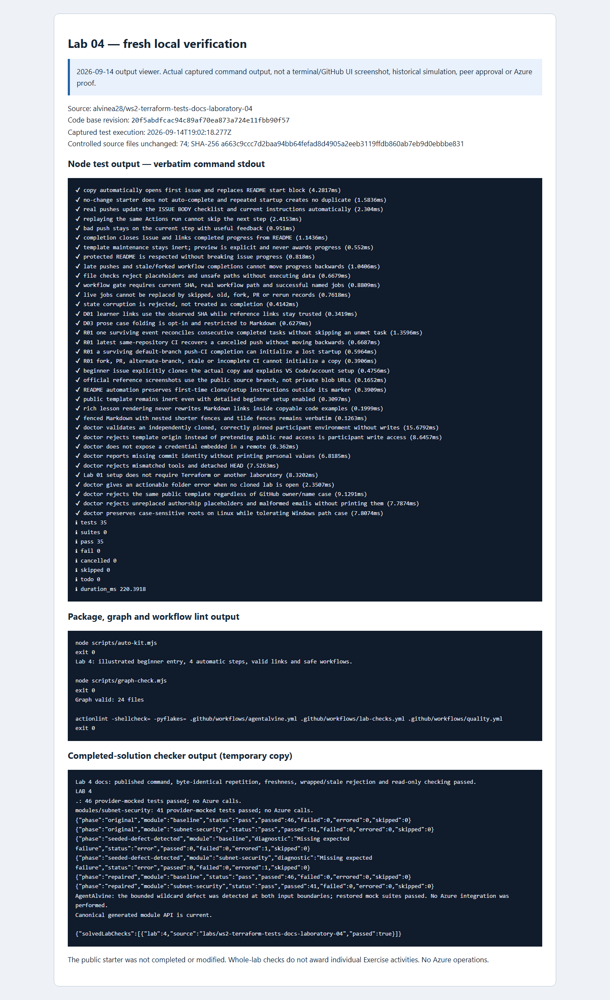

# Laboratory 04 — Recorded simulations and review evidence

[Review index](README.md) · [Full setup](00-start-here.md) · [First activity](activity-01.md)

## Original participant cycles — 2026-09-08

These are the preserved **Revision 4 Cycle A and Cycle B** results, not fresh tests and not the public source Preview. The [original public maintenance summary](../docs/daily%20work%20report/2026-09-08.md) reports the same whole-lab counts. **Both cycles completed all four activities, including documentation**; do not carry an earlier documentation-generator failure forward as an unresolved Revision 4 A/B blocker or invent a fix date from aggregate totals.

| Original cycle | Exercise progress | Whole-lab Node tests passed | Mocked cases/fixtures passed | Scope |
| --- | --- | --- | --- | --- |
| A | 4/4 | 32 | 89 | Full offline tests-and-documentation learner path complete |
| B | 4/4 | 35 | 89 | Full offline tests-and-documentation learner path complete |

### Per-activity outcomes

| Activity | What the preserved progress records establish | Cycle A | Cycle B |
| --- | --- | --- | --- |
| [01 — Positive and negative learner cases](activity-01.md) | The learner supplied `learner_valid_subnets` and `learner_reject_invalid_cidr`, with the expected input-validation target. | Recorded verified | Recorded verified |
| [02 — Detector and actual sample](activity-02.md) | The sample source was narrowed to `10.42.1.0/24`; the full checker included the actual sample fixture and isolated seed detector. | Recorded verified | Recorded verified |
| [03 — Generated module API](activity-03.md) | The actual module API satisfied the required interface sections and canonical freshness gate. | Recorded verified | Recorded verified |
| [04 — Consumer entry and full CI](activity-04.md) | Root/example consumption docs and the successful complete **Test learner module** gate brought the Exercise to 4/4 offline completion. | Recorded verified | Recorded verified |

The cycles exercised private learner copies, authored tests/sample/docs, pushed revisions, and actual issue progression. The baseline and security child were supplied complete; the shipped validators were not deliberately broken. The toolchain was Node **24.16.0**, Terraform **1.16.1**, AzureRM **5.4.0**, and terraform-docs **0.24.0**. Backend-disabled/read-only-lock initialization and provider mocks do not need Azure or remote state, although provider downloads may need internet access.

### What the full learner path covers

The [full checker](../scripts/check-learner.mjs) covers these distinct lanes. **89 is a case/fixture execution total, not 89 unique test names and not a per-activity allocation.**

| Lane | Recorded completed-lab scope |
| --- | --- |
| Learner root | 46 mocked cases, including the two learner-authored cases. |
| Included standalone security child | 41 mocked cases at its own boundary. |
| Corrected actual sample | Two learner cases executed with the sample fixture; these are already included as the fixture portion of 89, not extra unique names. |
| Isolated seed detector | Original, seeded-defect-detected, and repaired phases at both boundaries; repeated healthy/restored suites are not added again to 89. |
| Canonical API freshness | The shared generator renders the actual module for comparison; this is not another Terraform case count. |

The intended CIDR rejection uses `10.300.0.0/16` and `expect_failures = [var.address_space]`. The wildcard-ingress regression targets `var.security_rules` at the composed baseline and `var.rules` at the standalone child. The [seed harness](../scripts/test-seeded-defect.mjs) weakens both guards only in an isolated temporary reference copy, requires **Missing expected failure** in the middle phase, and restores both before retesting. In Terraform 1.16.1 that expected detector diagnostic has `status: error` and `errored: 1`; it is not an arbitrary failure accepted as a pass. Zero/skipped tests, malformed mocks, provider errors, and failed restoration do not qualify.

### Documentation verification: exact procedure, bounded claims

The complete [third activity](activity-03.md) preserves the actual `node scripts/generate-docs.mjs` procedure: generate from the root, generate again to inspect determinism, then use `--check`. The [generator](../scripts/generate-docs.mjs) uses terraform-docs 0.24.0 canonical standard output, and the full checker uses that same renderer. Stale or output-wrapped text is not accepted merely because section headings exist.

The preserved A/B aggregate results establish completed documentation/freshness gates. They are **not by themselves separate execution records for a twice-generation determinism experiment or stale/wrapped-content rejection experiment**. Such detailed historical claims require the corresponding original records in the private review; none is invented here, counted as an extra test, or presented as fresh 2026-09-14 verification.

**32/35 are whole-lab Node totals, not per-activity tests.** Across **all eight laboratories**, each original cycle recorded **25/33 activities**; Cycle A recorded **301 Node tests**, Cycle B **325 Node tests**, and **each cycle recorded 229 mocked cases/fixtures**. Those all-lab totals already include this lab. Do not add repeated helper/CI runs, focused fixtures, original/repaired seed phases, per-activity rows, or later verification to them. Node tests, Terraform case/fixture executions, and detector phases are different measures.

## Original proof stays private

Authorized reviewers can open the [original Lab 04 private review and immutable evidence links](https://github.com/alvine-aurelio-org/ws2-public-rebuild-20260908-evidence/blob/dev/full-ws-content/lab-04/README.md). **Organization access is required.** The detailed originals, preserved immutable records, and private CI links remain there; this public summary does not reproduce raw participant logs or private CI commit identifiers.

No historical per-activity screenshots existed. The private activity images were captured on **2026-09-14** from a labelled local viewer of the preserved original A/B records, not September 8 GitHub UI. Screenshots support interpretation; the original immutable records and linked CI evidence in the private review are the proof.

## Separate verification and screenshots — 2026-09-14

- **Source Exercise:** the read-only GitHub observation confirmed the [live public Exercise #1](https://github.com/alvinea28/ws2-terraform-tests-docs-laboratory-04/issues/1) as an instructor Preview after a successful real run, at **step 0 with 0/4 participant progress**. Its actual GitHub screenshot is on the [review index](README.md#public-source-preview--read-only-not-your-learner-issue), with PNG digest and capture timestamp in [images/provenance.json](images/provenance.json); it is not either private simulation issue.
- **Fresh local validation:** source-quality checks and the real completed-solution fixture checker passed, with the solution exercised in an isolated **temporary copy**. The pinned workshop toolchain was Terraform **1.16.1**, AzureRM **5.4.0**, and terraform-docs **0.24.0** for documentation checks. No Azure operations occurred.

### Fresh 2026-09-14 verified results

| Check | Result |
| --- | --- |
| Node tests | 35 passed; 0 failed; 0 skipped |
| auto-kit | Passed |
| graph | Passed |
| actionlint | Passed |
| Completed-solution checker | Passed — isolated temporary copy |

These are fresh whole-lab checks, not per-activity proof or new mock totals. The [fresh command record (organization access required)](https://github.com/alvine-aurelio-org/ws2-public-rebuild-20260908-evidence/blob/dev/evidence/review-2026-09-14/local/lab-04.json) is separate from the original A/B records; their progress and counts are unchanged.

*Captured on 2026-09-14 from a labelled local output viewer of the actual fresh commands, including the completed-solution fixture check in a temporary copy. This is not terminal UI, historical GitHub UI, a third participant cycle, or human/live approval. [images/provenance.json](images/provenance.json) records the PNG SHA-256 and exact capture timestamp.*

## What remains outside the evidence

No Azure deployments, identity creation, state access, or subscription operations were performed in these offline simulations or this documentation pass. No live policy, reachability, deployment/cleanup, cloud health, GUI onboarding, MFA flow, Copilot seat, or human approval is proved. No functional offline blocker remained recorded for this lab. Mock success, generated documentation, and an Exercise checkbox never authorize Azure or replace later genuine release review.
